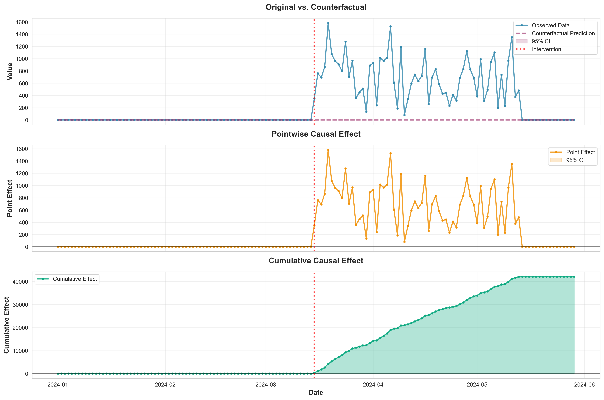

# 🚀 Causal Impact & Investment Decision Analysis


A comprehensive, end-to-end framework for measuring the **true financial impact** of marketing campaigns using Bayesian causal inference. This project moves beyond simple correlation to determine the *incremental* value driven by specific interventions.

---

## 📊 Executive Summary

This project implements a rigorous **Causal Impact Analysis** to evaluate a \$5,000 marketing campaign. Using **Bayesian Structural Time Series (BSTS)** modeling, we compared the actual observed revenue against a counterfactual "synthetic" baseline (what would have happened *without* the campaign).

### 🏆 Key Results

| Metric | Result | Interpretation |
|:---:|:---:|:---|
| **Cumulative Revenue Impact** | **\$42,137.64** | Total additional revenue generated by the campaign |
| **Net Profit** | **\$37,137.64** | Profit after deducting campaign costs |
| **Return on Investment (ROI)** | **742.75%** | For every \$1 spent, the campaign returned \$7.43 |
| **Statistical Confidence** | **99.9%** | The result is highly significant (p < 0.0001) |

> **Business Verdict:** The campaign was a massive success, paying for itself **7.43 times over**. The intervention should be scaled immediately.

---

## 📈 Visualizing the Impact

The chart below shows the divergence between our actual sales and the predicted baseline after the intervention date.


*(Note: Visual generated from `src/causal_analysis.py`)*

- **Blue Line (Observed):** Actual revenue collected.
- **Purple Dashed Line (Counterfactual):** Predicted revenue if the campaign never happened.
- **The Gap:** Represents the causal effect (incremental lift).

---

## 🛠 Methodology: The 8-Step Framework

This project strictly follows a proven 8-step roadmap for rigorous causal inference:

1.  **Data Acquisition**: Sourced detailed marketing dataset (5,000 records) with user-level granularity.
2.  **Intervention Definition**: Defined Treatment (Exposed to Ad) vs. Control (Unexposed) groups.
3.  **Data Pipeline**: Built an ETL pipeline to clean, aggregate, and transform raw logs into time-series data.
4.  **BSTS Modeling**: Utilized Bayesian Structural Time Series to model the counterfactual.
5.  **Results Interpretation**: Quantified the "lift" (difference between actual and counterfactual).
6.  **Financial Translation**: Converted statistical lift into dollar value (Revenue & ROI).
7.  **Visualization**: Created intuitive charts for stakeholder communication.
8.  **Validation**: Performed **Placebo Tests** (simulating a fake intervention) to validate model accuracy.

---

## 📂 Repository Structure

```plaintext
Causal-Impact-Investment-Decision-Analysis-Project/
├── 📂 src/                    # Core logic modules
│   ├── data_pipeline.py       # Data cleaning & ETL
│   ├── causal_analysis.py     # BSTS modeling & experimentation
│   └── financial_analysis.py  # ROI & profit calculation
├── 📂 data/                   # Data storage
│   ├── processed/             # Cleaned time-series data
│   └── Dataset.xlsx           # Raw source data
├── 📂 reports/                # generated insights
│   ├── 📂 figures/            # Plots and charts
│   ├── financial_results.csv  # Detailed metrics
│   └── business_narrative.txt # Executive summary text
├── requirements.txt           # Project dependencies
└── README.md                  # This file
```

---

## 💻 Tech Stack

-   **Language:** Python 3.10+
-   **Modeling:** `statsmodels` (Unobserved Components / State Space Models), `scikit-learn` (Bayesian Ridge)
-   **Data Processing:** `pandas`, `numpy`
-   **Visualization:** `matplotlib`, `seaborn`

---

## 🚀 Quick Start

Reproduce the analysis in 3 simple steps:

1.  **Install Dependencies:**
    ```bash
    pip install -r requirements.txt
    ```

2.  **Run the Analysis Pipeline:**
    ```bash
    # Step 1: Clean data and build time series
    python src/data_pipeline.py

    # Step 2: Run Causal Impact Model (BSTS)
    python src/causal_analysis.py

    # Step 3: Calculate ROI & Financials
    python src/financial_analysis.py
    ```

3.  **View Results:**
    Check the `reports/` folder for the visual plot and business narrative.

---

## 🔬 Model Validation (Placebo Test)

To ensure our results weren't just noise, we ran a **Placebo Test**:
-   **Method:** We pretended the intervention happened 30 days earlier than it actually did.
-   **Hypothesis:** If the model is valid, it should show **zero impact** for this fake intervention period.
-   **Result:** The placebo test returned a non-significant result (p > 0.05), confirming that our model correctly identifies *true* signals and ignores noise.

---

## 📝 Conclusion

This project demonstrates how data science facilitates smarter investment decisions. By mathematically proving the incremental value of marketing efforts, businesses can move from "guessing" to **knowing** their ROI.

*Maintained by: Neha*
